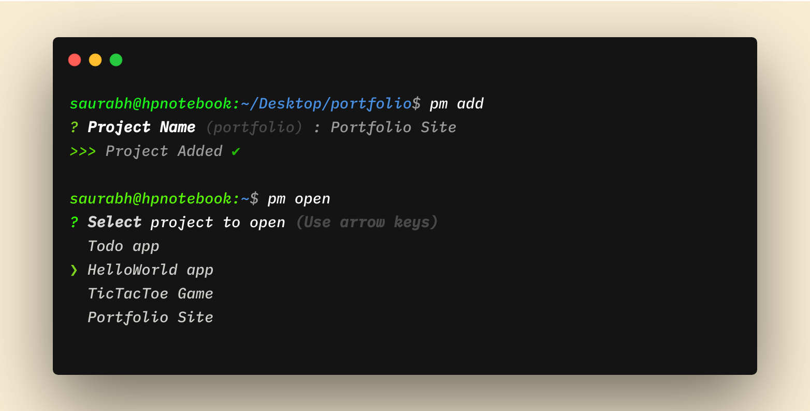

# ProjectMan🦸


[](https://www.npmjs.org/package/projectman) [](http://npm-stat.com/charts.html?package=projectman)
[](https://github.com/saurabhdaware/projectman/issues) [](https://github.com/saurabhdaware/projectman/blob/master/LICENSE)

[](https://www.npmjs.com/package/projectman)

ProjectMan is a project manager command line tool to easily save/open your favorite projects right from command line in your favorite text editor. 

Are you lazy to 'cd Desktop/projects/react/coolsite' and then open the folder in your favorite text editor? Add your favorite projects using `projectman add` and open them anytime you want using `projectman open`

---

## Installation
```shell
npm install -g projectman
```
---



---
## Commands

`pm` is an alias of `projectman` so you can use `pm <command>` or `projectman <command>`

### Open Project
```shell
pm open
```
optionally you can also directly enter the name of your project as an argument 
```shell
pm open myProject
```

### Add project
```shell
cd /till/the/project
pm add
```

### Remove Project

Just do `pm remove` and select the project from the list
or do `pm remove <projectName>`


### Set Editor

```shell
pm seteditor
```
This will show you available options of text editors. You can select from them and get started!

*Note: This package will only work with atom if you have the binaries inside environment variable (i.e `atom <projectDirectory>` works)*

*You might have to `sudo` while running add, remove, seteditor command as they need to write settings.json inside global npm directory*

---

## Settings.json
type `pm edit` or `projectman edit` to open settings.json


#### Example settings:
```json
{
    "commandToOpen": "code",
    "projects": [
        {
            "name": "Project1",
            "path": "path/to/project1"
        },
        {
            "name": "Project2",
            "path": "path/to/project2"
        }
    ]
}
```

#### Settings Ref:

**> commandToOpen** :
- This command will be used to open the file in your editor.
- Default is `code` which opens in vscode.
- For atom set value to `atom`
- For sublime set value to `subl`

**> projects -> name :**
- This is the name that will be visible when you type `projectman open`

**> projects -> path :**
- This should be the absolute path to your folder.


Please note that the settings will be rewrote everytime you update the package so I will suggest to take copy of your settings.json

---

## Contributing to ProjectMan
[](https://github.com/saurabhdaware/projectman/issues) 

I would be extremely happy to have people contribute to ProjectMan. You can read Contribution guidelines in **[CONTRIBUTING.md](CONTRIBUTING.md)**

---

**Thank you for showing Interest! Do contribute and star to [ProjectMan🦸 on GitHub](https://github.com/saurabhdaware/projectman)**